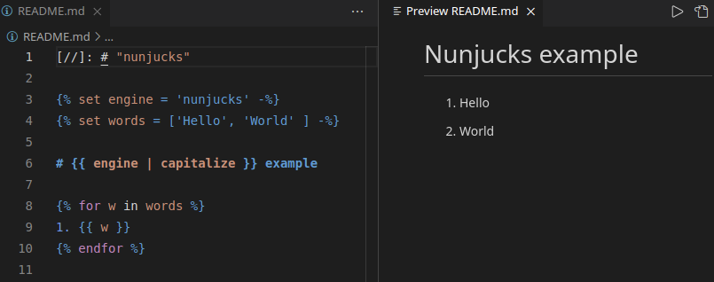
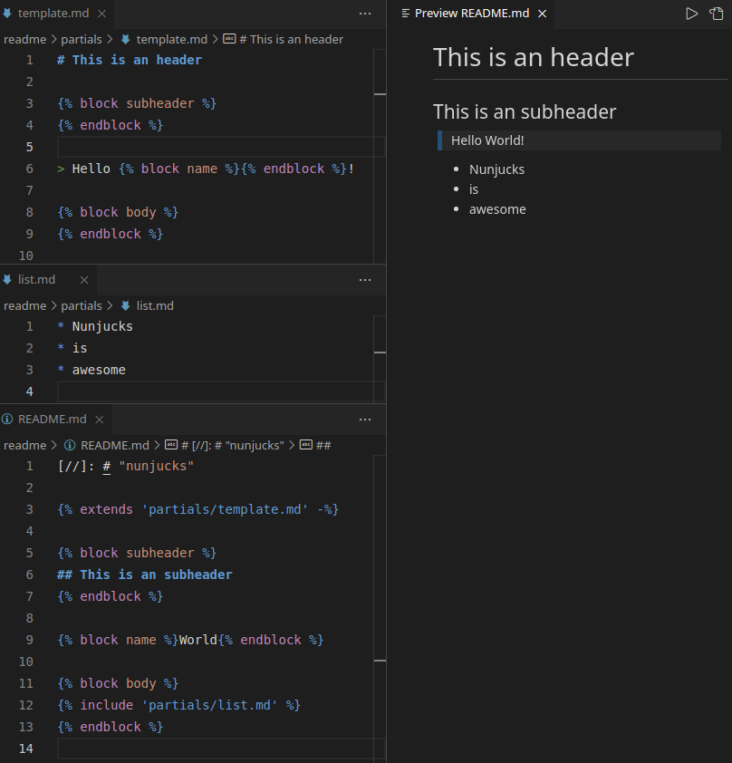

# nunjucks-markdown

Render Markdown files using Nunjucks template engine.

## Activation

Enable the rendering of Nunjucks templates on VSCode Markdown preview by starting the `*.md` file with the marker `[//]: # "nunjucks"`

## Full Nunjucks support

You can use all of Nunjucks filters, tags, expressions and functions.

## Template inheritance and includes

You can use template inheritance and includes. The extension will load the files relative to `/`, in case you open a single file, or relative to the workspace root folder the file is child of, in case of workspaces or [Multi-root Workspaces](https://code.visualstudio.com/docs/editor/multi-root-workspaces).

## For more information

* [Visual Studio Code Docs](https://code.visualstudio.com/docs)
* [Nunjucks by Mozilla](https://mozilla.github.io/nunjucks)
* [Nunjucks extension by ronnidc](https://marketplace.visualstudio.com/items?itemName=ronnidc.nunjucks)

## Credits

This extension uses the grammar provided by [Nunjucks extension by ronnidc](https://marketplace.visualstudio.com/items?itemName=ronnidc.nunjucks) and injects it on the Markdown grammar provided by [Microsoft](https://github.com/microsoft/vscode-markdown-tm-grammar).
